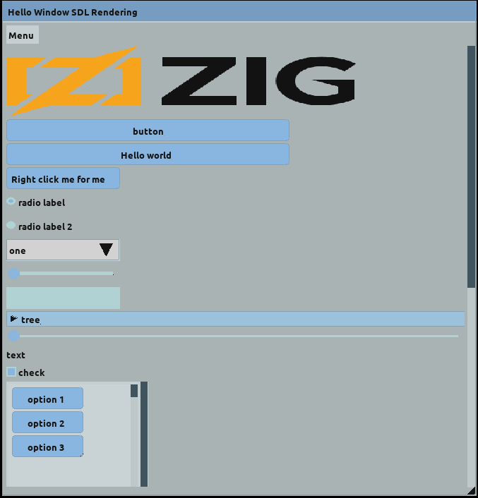
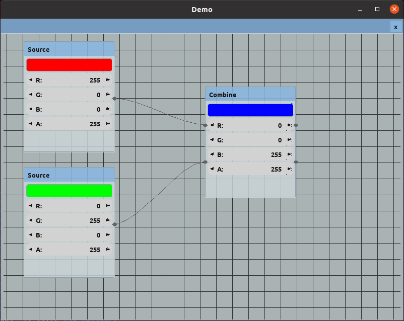

# Zig-Nuklear playground

This repository contains a simple sdl2 backend implementation in Zig, leverage the use of zig-nuklear immediate GUI for zig.

Using Zig 0.8

some screenshots :

## SDL2 backend implementation

This backend needs SDL dev libs installed, 
the SDL2_gfx repository also needs to be compiled and build

